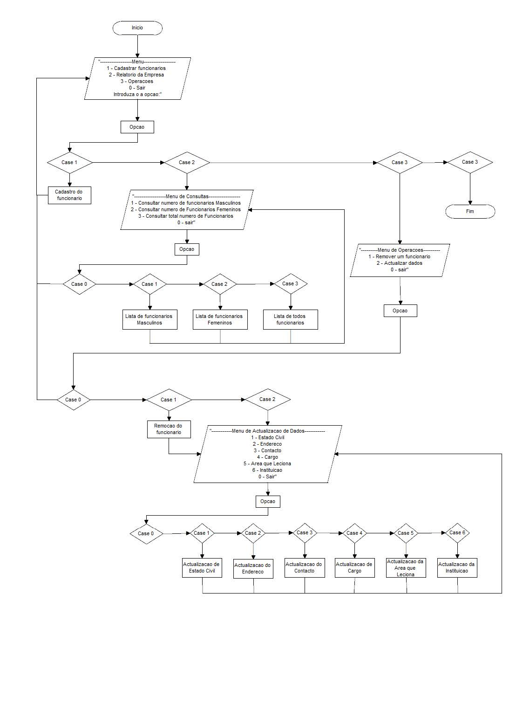

# Sistema de Gestao de Rescursos Humanos
## Descrição
Recursos Humanos é um requisito que sem ele não existe empresa/instituição nenhuma.
Este Sistema (SGRH) tem como objectivo simplificar/melhorar a vida dos gestores de recursos no concerne a distribuição das várias áreas e funcionalidades de uma determinada empresa. _Um "Sistema de Gestão de Recursos Humanos é um conjunto de acções que visam planejar, recrutar e seleccionar pessoas, analise e descrição de cargas e funções."_

## Funcionamento
Sistema de Gestao de Recursos humanos. 
É um projecto ainda em desenvolvimento, que consiste inicialmente num sistema que faza operações básicas de recursos humanos.
Como referência foca-se, como ponto de partida num centro de explicação, tentando estruturar os recursos humanos da mesma e operações sobre tais recursos... 

## Requisitos
- [Java developement Kit 8 update 191](https://WWW.JAVA.COM/) (or above);
- [Net Beans 8.0.2](https://www.netbeans.com/) (recomended);
## Features
- Controlo do efectivo da empresa (Número de Trabalhadores).
- Cadastro de novos funcionários como demissão dos mesmos.
- Fazer o Cadastro;
- Controle de Carga horaria.
- Cálculo do salário.
- Cálculo das despesas.
- Gerar relatórios
## License
[MIT](LICENSE)

Copyright (c) Henrique Mateus. All rights reserved.

